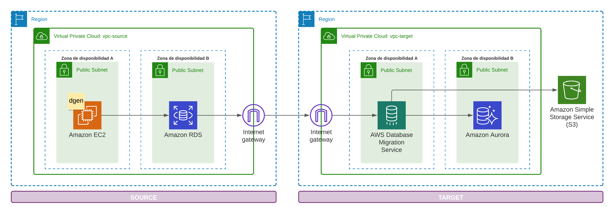

# Data Base Migration with AWS DMS

This project simulates a database migration from an Oracle Database (Version 12) to an Aurora Cluster (Postgres Engine). For simulation purpose, the source database (Oracle) is in one AWS Region (Default: Oregon) and the Aurora Cluster is in another (Default: N. Virginia).

The following diagram illustrates the migration architecture.



The previous image illustrates the main components of the architecture but be aware that terraform will help us to create 36 resources. For example, AWS DMS component will be composed of:

* 1 AWS DMS replication instance.
* 1 AWS DMS replication subnet group (With 2 subnets attached).
* 3 AWS DMS endpoints - One for the Oracle (```source```), one for Aurora-Postgres (```target```) and the last one for S3 (```target```).
* 2 AWS DMS replication tasks - One for Aurora-Postgres and one for S3.

**Important Note**: At this point is important to be aware that the ```AWS DMS replication task``` won't start automatically after the creation of this resource. Currently, you must start the task manually after the ```terrafrom apply``` command execution. Another important aspect of this terraform code, is that you must stop the ```AWS DMS replication task``` manually before executing ```terrafrom destroy```, if you don't do this, terraform will hit a timeout exception while destroying some resources because AWS can't release the resources attached to the replication tasks.

## 1. Create the Data Generator AMI

### Create and configure an EC2 Instance

Create an EC2 instance with AWS Linux 2 AMI manually and connect to the instance using SSH.

To configure the EC2 instance, please download ```oracle-instantclient12.2-basic-12.2.0.1.0-1.x86_64.rpm``` from [this site](https://www.oracle.com/database/technologies/instant-client/linux-x86-64-downloads.html). Once you have downloaded the file, proceed with the installation:

```bash
sudo yum install oracle-instantclient12.2-basic-12.2.0.1.0-1.x86_64.rpm
sudo sh -c "echo /usr/lib/oracle/12.2/client64/lib > /etc/ld.so.conf.d/oracle-instantclient.conf"
sudo ldconfig
export LD_LIBRARY_PATH=/usr/lib/oracle/12.2/client64/lib:$LD_LIBRARY_PATH
python3 -m pip install cx_Oracle pandas --upgrade --user
```

**Note:** If you plan to use another oracle version, you have change the value of ```engine_version``` in the ```rds.tf``` file located inside the module ```source``` to match the version you need to use.

### Download dgen

Go to the **dgen** repository.

### Create AMI

To create the AMI please execute the following command, using the right Instance <value>:

```bash
aws iam ....
```

### Create a key

Because the EC2 instance created through the EC2 resource of terraform is configured with the usage of a key, you have to create the one asymmetric key. To do this please execute:

```bash
ssh-keygen XXX
```

**Note:** Be aware of the destination of your key. By default, the private key will be located inside the ```~/.ssh/``` folder, but if you have changed the location, please update the value of ```public_key``` in the ```ec2.tf``` file located inside the module ```source```, or allocate the key private key in the right place to avoid making adjustments to the terraform code.

## 2. Define Terraform variables

Create a file named ```var.tfvars``` at the root of the project.

```bash
nano var.tfvars
```

Paste the following text writing the right values:

```hcl
ec2_ami            = "<value>"
key_name           = "<value>"
key_path           = "<value>"
source_db_username = "<value>"
source_db_password = "<value>"
target_db_username = "<value>"
target_db_password = "<value>"
```

For ```ec2_ami``` variable, use the id from AMI created in the previous steps. For the other ones, just write the appropriate values for your implementation.

## 3. DMS Task Configuration (for *Oracle* to *Aurora*)

For this step you don`t have to do anything. This is only to check the stablished configuration defined this project. If you need to change something, go ahead to the ```dms.tf``` file located in the ```target``` module.

* Table mappings:

```hcl
    {
      rules = [
        {
          object-locator = {
            schema-name = "SCHEMANAME"
            table-name  = "%"
          }
          rule-action = "include"
          rule-id     = "1"
          rule-name   = "1"
          rule-type   = "selection"
        },
      ]
    }
```

Check the appendix section to identify the ```Replication task settings``` for ```oracle-to-aurora``` and ```oracle-to-s3```.

## 4. Execute Terraform Apply

```bash
terraform apply -var-file=vars.tfvars -auto-approve 
```

## 5. Preload

## 6. Test endpoints

To test the available endpoints (connections) we have to start the testing process manually with the console, in the **AWS DMS > endpoints** section, or with the following commands replacing the values with the right outputs of the ```terraform apply``` execution:

* Testing the connection (Oracle | Aurora-Postgres | S3):

```bash
aws dms test-connection \
  --replication-instance-arn <value> \
  --endpoint-arn <value>
```

* Checking the connections:

Check that after executing the following command each endpoint must show ```"Status": "successful"```.

```bash
aws dms describe-connections
```

## 6. Start migration tasks

Like the previous step, to execute the migration tasks we have to start them manually with the console, in the **AWS DMS > replication task** section, or with the following commands replacing the values with the right outputs of the ```terraform apply``` execution:

* Run task (Aurora-Postgres | S3):

```bash
aws dms start-replication-task \
  --replication-task-arn <value> \
  --start-replication-task-type start-replication
```

Note that we are using ```start-replication``` for replication task type, but you can also use ```resume-processing```. Check [this link](https://awscli.amazonaws.com/v2/documentation/api/latest/reference/dms/start-replication-task.html) to learn more about the task starting process.

* Checking the tasks:

```bash
aws dms describe-replication-tasks
```

## 7. Ongoing Changes (CDC: Change Data Capture)

## 8. Stop and Destroy

```bash
aws dms stop-replication-task \
  --replication-task-arn <value>
```

This process cloud take a couple of minutes and at the end we have to see ```"Status": "stopped"``` with the following command.

* Checking the tasks:

```bash
aws dms describe-replication-tasks
```

After checking the status (has to be ```stopped```), we can destroy all the resources we created with:

```bash
terraform destroy -var-file=vars.tfvars -auto-approve
```

At this point you have learned how to migrate an Oracle Database with the Ongoing Changes (CDC) schema to an Aurora cluster and a S3 Bucket.

I hope you have enjoyed this material.
Thanks :smile:

-----

## Good Examples and Resources

**Terraform:**

* [Multi-environment and multi-region infrastructure](https://dev.to/sdileep/manage-a-multi-environment-multi-region-infrastructure-on-aws-using-terraform-1p2p)
* [Multi-region deployment](https://medium.com/johnveldboom/terraform-multi-region-deployment-using-modules-4f94d7833b52)
* [AWS resources across multiple regions](https://discuss.hashicorp.com/t/creating-aws-resources-with-terraform-across-multiple-regions/25010/2)
* [Migrating oracle to AWS aurora postgress](https://medium.com/paul-zhao-projects/migrating-an-oracle-instance-to-aws-rds-aurora-postgresql-using-terraform-d30db6b75816)

**Oracle SQL and Data Structure Example:**

* [Oracle delete cascade foreign keys](https://www.sqlsplus.com/oracle-delete-cascade-foreign-keys-with-cascade-delete/)
* [Db Structure and ERD](https://www.w3resource.com/sql/sql-table.php)

**Python lib for Oracle connectivity:**

* [Instant-client](https://www.oracle.com/database/technologies/instant-client/linux-x86-64-downloads.html)
* [Lib ```cx-oracle```](https://cx-oracle.readthedocs.io/en/latest/user_guide/installation.html)

-----

## Appendix

* Oracle-to-Aurora Replication task settings:

```hcl
    {
      BeforeImageSettings = null
      ChangeProcessingDdlHandlingPolicy = {
        HandleSourceTableAltered   = true
        HandleSourceTableDropped   = true
        HandleSourceTableTruncated = true
      }
      ChangeProcessingTuning = {
        BatchApplyMemoryLimit         = 500
        BatchApplyPreserveTransaction = true
        BatchApplyTimeoutMax          = 30
        BatchApplyTimeoutMin          = 1
        BatchSplitSize                = 0
        CommitTimeout                 = 1
        MemoryKeepTime                = 60
        MemoryLimitTotal              = 1024
        MinTransactionSize            = 1000
        StatementCacheSize            = 50
      }
      CharacterSetSettings = null
      ControlTablesSettings = {
        ControlSchema                 = ""
        FullLoadExceptionTableEnabled = false
        HistoryTableEnabled           = false
        HistoryTimeslotInMinutes      = 5
        StatusTableEnabled            = false
        SuspendedTablesTableEnabled   = false
      }
      ErrorBehavior = {
        ApplyErrorDeletePolicy                      = "IGNORE_RECORD"
        ApplyErrorEscalationCount                   = 0
        ApplyErrorEscalationPolicy                  = "LOG_ERROR"
        ApplyErrorFailOnTruncationDdl               = false
        ApplyErrorInsertPolicy                      = "LOG_ERROR"
        ApplyErrorUpdatePolicy                      = "LOG_ERROR"
        DataErrorEscalationCount                    = 0
        DataErrorEscalationPolicy                   = "SUSPEND_TABLE"
        DataErrorPolicy                             = "LOG_ERROR"
        DataTruncationErrorPolicy                   = "LOG_ERROR"
        FailOnNoTablesCaptured                      = true
        FailOnTransactionConsistencyBreached        = false
        FullLoadIgnoreConflicts                     = true
        RecoverableErrorCount                       = -1
        RecoverableErrorInterval                    = 5
        RecoverableErrorStopRetryAfterThrottlingMax = true
        RecoverableErrorThrottling                  = true
        RecoverableErrorThrottlingMax               = 1800
        TableErrorEscalationCount                   = 0
        TableErrorEscalationPolicy                  = "STOP_TASK"
        TableErrorPolicy                            = "SUSPEND_TABLE"
      }
      FailTaskWhenCleanTaskResourceFailed = false
      FullLoadSettings = {
        CommitRate                      = 10000
        CreatePkAfterFullLoad           = false
        MaxFullLoadSubTasks             = 8
        StopTaskCachedChangesApplied    = false
        StopTaskCachedChangesNotApplied = false
        TargetTablePrepMode             = "DROP_AND_CREATE" 
        TransactionConsistencyTimeout   = 600
      }
      Logging = {
        EnableLogging = true
        LogComponents = [
          {
            Id       = "TRANSFORMATION"
            Severity = "LOGGER_SEVERITY_DEFAULT"
          },
          {
            Id       = "SOURCE_UNLOAD"
            Severity = "LOGGER_SEVERITY_DEFAULT"
          },
          {
            Id       = "IO"
            Severity = "LOGGER_SEVERITY_DEFAULT"
          },
          {
            Id       = "TARGET_LOAD"
            Severity = "LOGGER_SEVERITY_DEFAULT"
          },
          {
            Id       = "PERFORMANCE"
            Severity = "LOGGER_SEVERITY_DEFAULT"
          },
          {
            Id       = "SOURCE_CAPTURE"
            Severity = "LOGGER_SEVERITY_DEFAULT"
          },
          {
            Id       = "SORTER"
            Severity = "LOGGER_SEVERITY_DEFAULT"
          },
          {
            Id       = "REST_SERVER"
            Severity = "LOGGER_SEVERITY_DEFAULT"
          },
          {
            Id       = "VALIDATOR_EXT"
            Severity = "LOGGER_SEVERITY_DEFAULT"
          },
          {
            Id       = "TARGET_APPLY"
            Severity = "LOGGER_SEVERITY_DEFAULT"
          },
          {
            Id       = "TASK_MANAGER"
            Severity = "LOGGER_SEVERITY_DEFAULT"
          },
          {
            Id       = "TABLES_MANAGER"
            Severity = "LOGGER_SEVERITY_DEFAULT"
          },
          {
            Id       = "METADATA_MANAGER"
            Severity = "LOGGER_SEVERITY_DEFAULT"
          },
          {
            Id       = "FILE_FACTORY"
            Severity = "LOGGER_SEVERITY_DEFAULT"
          },
          {
            Id       = "COMMON"
            Severity = "LOGGER_SEVERITY_DEFAULT"
          },
          {
            Id       = "ADDONS"
            Severity = "LOGGER_SEVERITY_DEFAULT"
          },
          {
            Id       = "DATA_STRUCTURE"
            Severity = "LOGGER_SEVERITY_DEFAULT"
          },
          {
            Id       = "COMMUNICATION"
            Severity = "LOGGER_SEVERITY_DEFAULT"
          },
          {
            Id       = "FILE_TRANSFER"
            Severity = "LOGGER_SEVERITY_DEFAULT"
          },
        ]
      }
      LoopbackPreventionSettings = null
      PostProcessingRules        = null
      StreamBufferSettings = {
        CtrlStreamBufferSizeInMB = 5
        StreamBufferCount        = 3
        StreamBufferSizeInMB     = 8
      }
      TargetMetadata = {
        BatchApplyEnabled            = false
        FullLobMode                  = false
        InlineLobMaxSize             = 0
        LimitedSizeLobMode           = true
        LoadMaxFileSize              = 0
        LobChunkSize                 = 0
        LobMaxSize                   = 32
        ParallelApplyBufferSize      = 0
        ParallelApplyQueuesPerThread = 0
        ParallelApplyThreads         = 0
        ParallelLoadBufferSize       = 0
        ParallelLoadQueuesPerThread  = 0
        ParallelLoadThreads          = 0
        SupportLobs                  = true
        TargetSchema                 = ""
        TaskRecoveryTableEnabled     = false
      }
      ValidationSettings = {
        EnableValidation                 = true
        FailureMaxCount                  = 10000
        HandleCollationDiff              = false
        MaxKeyColumnSize                 = 8096
        PartitionSize                    = 10000
        RecordFailureDelayInMinutes      = 5
        RecordFailureDelayLimitInMinutes = 0
        RecordSuspendDelayInMinutes      = 30
        SkipLobColumns                   = false
        TableFailureMaxCount             = 1000
        ThreadCount                      = 5
        ValidationMode                   = "ROW_LEVEL"
        ValidationOnly                   = false
        ValidationPartialLobSize         = 0
        ValidationQueryCdcDelaySeconds   = 0
      }
    }
```

Be aware of ```TargetTablePrepMode``` if you plan to use AWS SCT (Schema Conversion Tool).
